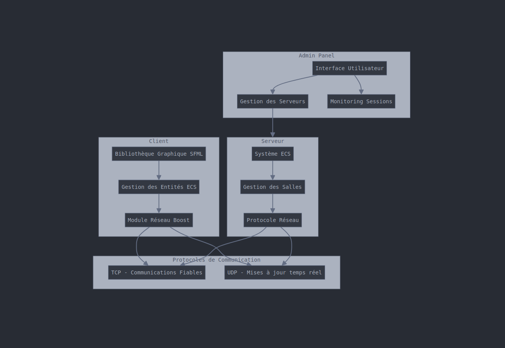

# Technical Documentation of the Project Architecture

## Introduction

This document provides an overview of the architecture of the R-Type project, a multiplayer game inspired by the famous arcade game. The project is structured around several key components, each playing a specific role in the overall functioning of the game.

## Project Structure

The project is divided into several main modules:

1. **Client**: Manages graphical display, user interactions, entity management, and network communication with the server. [See client documentation](../client/README.md)
2. **Server**: Implements the multiplayer game logic, manages game sessions, and synchronizes the game state between clients. [See server implementation documentation](../server%20implementation/README.md)
3. **Admin Panel**: Provides an interface for managing and monitoring game servers.

## Main Components

### Client

- **Graphics Library**: Uses SFML for managing graphics, sound, and events.
- **Entity Management**: Based on an entity-component system (ECS) for modular and extensible management of game entities.
- **Network**: Uses Boost for managing threads and network operations.

### Server

- **Entity-Component System (ECS)**: Manages game entities, their components, and the systems that manipulate them.
- **Room Management**: Manages multiplayer sessions, synchronizes player states, and manages game states.
- **Network Protocol**: Uses TCP for reliable communications and UDP for real-time updates. [See server protocol documentation](../server%20protocol/README.md)

### Admin Panel

- **User Interface**: Allows management of game servers, session monitoring, and game parameter configuration.

## Dependencies

- **SFML**: For managing graphics, sound, and events.
- **Boost**: For managing threads and network operations.
- **CMake**: For project configuration.
- **Conan**: For dependency management.



## Compilation and Execution

### Prerequisites

Ensure you have the following tools and libraries installed on your system:

- **CMake**: Project configuration tool.
- **Make**: Build tool.
- **g++**: C++ compiler.
- **SFML**: Graphics library.

### Compilation Instructions

1. Clone the project repository:
   ```bash
   git clone <REPOSITORY_URL>
   cd <REPOSITORY_NAME>
   ```

2. Create a build directory:
   ```bash
   mkdir build
   cd build
   ```

3. Run CMake to configure the project:
   ```bash
   cmake ..
   ```

4. Compile the project:
   ```bash
   make
   ```

### Execution

After compilation, you can run the generated executables:

- For the client:
  ```bash
  ./r-type_client <ip_address> <port>
  ```

- For the server:
  ```bash
  ./r-type_server <port>
  ```

## Communication between Client and Server

The client and server communicate via a network protocol that uses both TCP and UDP to ensure a smooth and responsive gaming experience.

### TCP Protocol

- **Initial Connection**: The client connects to the server using TCP to establish a reliable connection. This ensures that critical messages, such as player connections and room management, are transmitted without loss.
- **Room Management**: Information regarding the creation, management, and synchronization of game rooms is exchanged via TCP.

### UDP Protocol

- **Real-Time Updates**: UDP is used for real-time updates, such as player movements and quick interactions. This reduces latency and improves game responsiveness.
- **Game State Synchronization**: Game states, such as entity positions and game events, are regularly synchronized between the client and server via UDP.

### Component Integration

- **Entity Management**: The server uses an entity-component system (ECS) to manage game entities, while the client uses a similar system to display and interact with these entities.
- **Event Management**: Game events, such as shooting and collisions, are processed by both the client and server to ensure game consistency.

This architecture allows for efficient communication and robust management of multiplayer sessions, ensuring a smooth and responsive user experience.

## Conclusion

The R-Type project is a complex application that uses SFML for graphical display and Boost for managing threads and network operations. The ECS architecture allows for modular and extensible management of game entities. This documentation provides an overview of the main components and systems used in the project.

## Useful Links

- [Project build documentation](../build%20the%20project/README.md)
- [Client documentation](../client/README.md)
- [Comparative study of graphics libraries](../comparative%20studies/README.md)
- [Feature addition for developers](../feature%20addition%20for%20devs/README.md)
- [Server protocol documentation](../server%20protocol/README.md)
- [Server implementation documentation](../server%20implementation/README.md)
