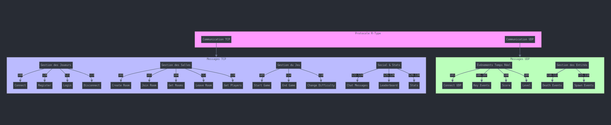

# Server Implementation Guide  
**Category**: Technical Documentation  
**Date**: 07/12/2024  

---

## Table of Contents

1. [Adding New Protocol Features](#1-adding-new-protocol-features)
2. [Entity Component System](#2-entity-component-system)
3. [Room Management](#3-room-management)
4. [Database Integration](#4-database-integration)
5. [Component System Details](#5-component-system-details)
6. [Factory System](#6-factory-system)
7. [Systems](#7-systems)
8. [Error Handling System](#8-error-handling-system)
9. [Game Engine System](#9-game-engine-system)
10. [Game Server Implementation](#10-game-server-implementation)
11. [Command-Line Parsing System](#11-command-line-parsing-system)
12. [Player Management System](#12-player-management-system)

---

## 1. Adding New Protocol Features

### Protocol Code Implementation

To add a new protocol code:
```cpp
// TCP Handlers
tcp_command_handlers = {
    {"100", std::bind(&Protocol::handleCommand100, this, std::placeholders::_1, std::placeholders::_2)},
    {"102", std::bind(&Protocol::handleCommand102, this, std::placeholders::_1, std::placeholders::_2)},
    {"103", std::bind(&Protocol::handleCommand103, this, std::placeholders::_1, std::placeholders::_2)},
    {"104", std::bind(&Protocol::handleCommand104, this, std::placeholders::_1, std::placeholders::_2)},
    {"105", std::bind(&Protocol::handleCommand105, this, std::placeholders::_1, std::placeholders::_2)},
    {"112", std::bind(&Protocol::handleCommand112, this, std::placeholders::_1, std::placeholders::_2)},
    {"113", std::bind(&Protocol::handleCommand113, this, std::placeholders::_1, std::placeholders::_2)},
    {"118", std::bind(&Protocol::handleCommand118, this, std::placeholders::_1, std::placeholders::_2)},
    {"119", std::bind(&Protocol::handleCommand119, this, std::placeholders::_1, std::placeholders::_2)},
    {"120", std::bind(&Protocol::handleCommand120, this, std::placeholders::_1, std::placeholders::_2)},
    {"121", std::bind(&Protocol::handleCommand121, this, std::placeholders::_1, std::placeholders::_2)},
    {"122", std::bind(&Protocol::handleCommand122, this, std::placeholders::_1, std::placeholders::_2)},
    {"123", std::bind(&Protocol::handleCommand123, this, std::placeholders::_1, std::placeholders::_2)},
    {"124", std::bind(&Protocol::handleCommand124, this, std::placeholders::_1, std::placeholders::_2)},
    {"125", std::bind(&Protocol::handleCommand125, this, std::placeholders::_1, std::placeholders::_2)},
    {"126", std::bind(&Protocol::handleCommand126, this, std::placeholders::_1, std::placeholders::_2)},
    {"127", std::bind(&Protocol::handleCommand127, this, std::placeholders::_1, std::placeholders::_2)}
};

// UDP Handlers
udp_command_handlers = {
    {"dump", std::bind(&Protocol::dumpUDP, this, std::placeholders::_1, std::placeholders::_2)},
    {"101", std::bind(&Protocol::handleCommand101, this, std::placeholders::_1, std::placeholders::_2)},
    {"106", std::bind(&Protocol::handleCommand106, this, std::placeholders::_1, std::placeholders::_2)},
    {"107", std::bind(&Protocol::handleCommand107, this, std::placeholders::_1, std::placeholders::_2)},
    {"108", std::bind(&Protocol::handleCommand108, this, std::placeholders::_1, std::placeholders::_2)},
    {"109", std::bind(&Protocol::handleCommand109, this, std::placeholders::_1, std::placeholders::_2)},
    {"110", std::bind(&Protocol::handleCommand110, this, std::placeholders::_1, std::placeholders::_2)},
    {"111", std::bind(&Protocol::handleCommand111, this, std::placeholders::_1, std::placeholders::_2)},
    {"115", std::bind(&Protocol::handleCommand115, this, std::placeholders::_1, std::placeholders::_2)},
    {"116", std::bind(&Protocol::handleCommand116, this, std::placeholders::_1, std::placeholders::_2)}
};
```



### Adding New Commands
1. Choose TCP or UDP based on reliability needs
2. Add handler to appropriate map
3. Implement handler function
4. Update protocol documentation

---

## 2. Entity Component System

### Entity Implementation
```cpp
class Entity {
public:
    Entity(int id, std::string group, std::string type) 
        : id_(id), group_(group), type_(type) {}
    
    // Component Management
    void addComponent(std::shared_ptr<Component> component);
    
    template <typename T>
    std::shared_ptr<T> getComponent() {
        for (auto component : components_) {
            if (std::shared_ptr<T> t = std::dynamic_pointer_cast<T>(component)) {
                return t;
            }
        }
        return nullptr;
    }
    
    // Getters and Setters
    int getId() const { return id_; }
    void setId(int id) { id_ = id; }
    std::string getGroup() const { return group_; }
    void setGroup(std::string group) { group_ = group; }
    std::string getType() const { return type_; }
    void setType(std::string type) { type_ = type; }
    
    // Deletion Management
    bool isMarkedForDeletion() const { return markedForDeletion_; }
    void markForDeletion() {
        markedForDeletion_ = true;
        if (this->getComponent<StateComponent>()) {
            this->getComponent<StateComponent>()->state = "DELETE";
        }
    }

private:
    int id_;
    std::string group_;
    std::string type_;
    std::vector<std::shared_ptr<Component>> components_;
    bool markedForDeletion_ = false;
};
```

### Key Features
1. **Smart Pointer Usage**
- Uses `std::shared_ptr` for automatic memory management
- Components are stored in a vector of shared pointers
- Prevents memory leaks and ensures proper cleanup
2. **Type-Safe Component Access**
- Template method `getComponent<T>()` for type-safe component retrieval
- Uses `dynamic_pointer_cast` for safe component type conversion
- Returns nullptr if component not found
3. Entity Management
- Unique ID system for entity tracking
- Group and type categorization
- Built-in deletion marking system
4. State Management
- Integrated with StateComponent for deletion state tracking
- Automatic state updates when marked for deletion

### Usage Example
```cpp
// Create a new entity
Entity enemy(1, "ENEMY", "BASIC");

// Add components using smart pointers
enemy.addComponent(std::make_shared<HealthComponent>(100));
enemy.addComponent(std::make_shared<PositionComponent>(0.0f, 0.0f));

// Retrieve and use components
if (auto health = enemy.getComponent<HealthComponent>()) {
    health->health -= 10;  // Reduce health
}

// Mark for deletion when needed
if (enemy.getComponent<HealthComponent>()->health <= 0) {
    enemy.markForDeletion();
}
```

---

## 3. Room Management

### Room Structure
```cpp
class Room {
private:
    std::string id;
    std::vector<std::string> players;
    GameState state;
    std::string difficulty;

public:
    void addPlayer(const std::string& playerId);
    void removePlayer(const std::string& playerId);
    bool isFull() const;
    void updateGameState(const GameState& newState);
};
```

### Room Operations
- Player management
- Game state updates
- Difficulty settings
- Broadcasting updates

---

## 4. Database Integration

### User Database Structure

```cpp
{
    "id": "string",
    "password": "string",
    "tcp_socket": "string",
    "udp_socket": "string",
    "username": "string"
}
```

### Database Functions
- readDatabaseFile()
- writeInDatabase()
- getUsernameFromId()
- getIdFromUsernameAndPassword()
- setUserId()
- checkIfPlayerAlreadyExist()
- getLeaderboard()
- setNewScoreInLeaderBoard()

---

## 5. Component System Details

### Base Component
The Component system is built on a base Component class that serves as the foundation for all specific component types:

```cpp
class Component {
public:
    Component() {}
    virtual ~Component() {}
};
```

### Core Components

#### PositionComponent
Handles entity position and position history:
```cpp
class PositionComponent : public Component {
public:
    float x, y;          // Current position
    float prev_x, prev_y;// Previous position
    
    void updatePrevPos() {
        prev_x = x;
        prev_y = y;
    }
};
```

#### VelocityComponent
Manages entity movement speed:
```cpp
class VelocityComponent : public Component {
public:
    float x, y;  // Velocity in x and y directions
};
```

#### HealthComponent
Tracks entity health:
```cpp
class HealthComponent : public Component {
public:
    int health;  // Current health value
};
```

### Gameplay Components

#### ScoreComponent
Manages scoring:
```cpp
class ScoreComponent : public Component {
public:
    int score;  // Current score value
};
```

#### DamageComponent
Defines damage capabilities:
```cpp
class DamageComponent : public Component {
public:
    int damage;  // Damage value
};
```

#### MovementComponent
Controls movement patterns:
```cpp
class MovementComponent : public Component {
public:
    std::string pattern;    // Movement pattern type
    std::string direction;  // Movement direction
};
```

### Special Components

#### TimerComponent
Handles time-based actions:
```cpp
class TimerComponent : public Component {
public:
    std::chrono::duration time;
    std::chrono::time_point start_time;
    std::chrono::time_point target_time;
};
```

#### BulletDataComponent
Comprehensive bullet management:
```cpp
class BulletDataComponent : public Component {
public:
    std::string type;
    int damage;
    HitboxComponent hitbox;
    VelocityComponent velocity;
    MovementComponent movement;
};
```

#### StateComponent
Manages entity states:
```cpp
class StateComponent : public Component {
public:
    std::string state;  // Current state
};
```

### Component Usage Guidelines

1. **Component Composition**
   - Components should be small and focused
   - Each component should handle one specific aspect of functionality
   - Components can be combined to create complex behaviors

2. **Memory Management**
   - Components are managed through pointers
   - Entity class handles component lifecycle
   - Use appropriate deletion in destructors

3. **Best Practices**
   - Always initialize component values in constructors
   - Use getter/setter methods for component properties
   - Keep components as lightweight as possible
   - Consider component dependencies when designing systems

---

## 6. Factory System

### Overview

The Factory System provides specialized factory classes for creating different types of entities with pre-configured components. Each factory implements the Static Factory pattern, offering a clean interface for entity creation.

### Bullet Factory

```cpp
BulletFactory {
public:
    static std::shared_ptr<Entity> createBullet(
        int id, 
        std::string group, 
        std::string type, 
        int damage, 
        float x, float y, 
        float speed, 
        float hw, float hh, 
        std::string pattern, 
        std::string direction
    ) {
        auto bullet = std::make_shared<Entity>(id, group, type);
        
        bullet->addComponent(std::make_shared<DamageComponent>(damage));
        bullet->addComponent(std::make_shared<PositionComponent>(x, y));
        bullet->addComponent(std::make_shared<VelocityComponent>(speed));
        bullet->addComponent(std::make_shared<HitboxComponent>(hw, hh));
        bullet->addComponent(std::make_shared<MovementComponent>(pattern, direction));
        bullet->addComponent(std::make_shared<StateComponent>("CREATE"));
        
        return bullet;
    }
};
```

### Enemy Factory
```cpp
EnemyFactory {
public:
    static std::shared_ptr<Entity> createEnemy(
        int id, 
        std::string type, 
        int health, 
        float x, float y, 
        float speed,
        float hw, float hh, 
        std::string pattern = "LINEAR", 
        std::string direction = "LEFT", 
        int shootTimer = 0,
        std::string bulletType = "BASIC", 
        int bulletDamage = 10, 
        float bulletVx = 1, 
        float bulletVy = 1, 
        float bulletHW = 1, 
        float bulletHH = 1, 
        int reward = 0
    ) {
        auto enemy = std::make_shared<Entity>(id, "ENEMY", type);
        
        enemy->addComponent(std::make_shared<HealthComponent>(health));
        enemy->addComponent(std::make_shared<PositionComponent>(x, y));
        enemy->addComponent(std::make_shared<VelocityComponent>(speed, speed));
        enemy->addComponent(std::make_shared<HitboxComponent>(hw, hh));
        enemy->addComponent(std::make_shared<MovementComponent>(pattern, direction));
        enemy->addComponent(std::make_shared<TimerComponent>(std::chrono::seconds(shootTimer)));
        enemy->addComponent(std::make_shared<BulletDataComponent>(
            bulletType, bulletDamage, bulletVx, bulletVy, bulletHW, bulletHH, "LINEAR", "LEFT"
        ));
        enemy->addComponent(std::make_shared<ScoreComponent>(reward));
        enemy->addComponent(std::make_shared<StateComponent>("CREATE"));
        
        return enemy;
    }
};
```

### Player Factory

```cpp
PlayerFactory {
public:
    static std::shared_ptr<Entity> createPlayer(
        int id, 
        std::string type, 
        int health, 
        float x, float y, 
        float speed, 
        float hw, float hh
    ) {
        auto player = std::make_shared<Entity>(id, "PLAYER", type);
        
        player->addComponent(std::make_shared<HealthComponent>(health));
        player->addComponent(std::make_shared<PositionComponent>(x, y));
        player->addComponent(std::make_shared<VelocityComponent>(speed, speed));
        player->addComponent(std::make_shared<HitboxComponent>(hw, hh));
        player->addComponent(std::make_shared<ScoreComponent>(0));
        player->addComponent(std::make_shared<StateComponent>("CREATE"));
        
        return player;
    }
};
```

### Powerup Factory
```cpp
PowerupFactory {
public:
    static std::shared_ptr<Entity> createPowerup(
        int id, 
        std::string group, 
        std::string type, 
        float x, float y, 
        float hw, float hh, 
        int lifetime
    ) {
        auto powerup = std::make_shared<Entity>(id, group, type);
        
        powerup->addComponent(std::make_shared<PositionComponent>(x, y));
        powerup->addComponent(std::make_shared<HitboxComponent>(hw, hh));
        powerup->addComponent(std::make_shared<TimerComponent>(std::chrono::seconds(lifetime)));
        powerup->addComponent(std::make_shared<StateComponent>("CREATE"));
        
        return powerup;
    }
};
```

### Factory System Features
1. **Static Factory Pattern**
- All factories use static methods
- No instance creation required
- Thread-safe entity creation
2. **Smart Pointer Integration**
- Returns `std::shared_ptr<Entity>`
- Automatic memory management
- Exception-safe entity creation
3. **Default State Management**
- All entities start with "CREATE" state
- Consistent initialization across factory types
- State tracking from creation
4. **Component Configuration**
- Pre-configured component sets for each entity type
- Sensible default values where appropriate
- Flexible parameter customization

### Usage Examples
Creating a bullet:
```cpp
auto bullet = BulletFactory::createBullet(
    1,              // id
    "PLAYER_BULLET",// group
    "BASIC",        // type
    10,             // damage
    100.0f, 200.0f, // x, y position
    5.0f,           // speed
    5.0f, 5.0f,     // hitbox width, height
    "LINEAR",       // movement pattern
    "RIGHT"         // direction
);
```

Creating an enemy:
```cpp
auto enemy = EnemyFactory::createEnemy(
    1,              // id
    "BASIC",        // type
    100,            // health
    400.0f, 100.0f, // x, y position
    2.0f,           // speed
    20.0f, 20.0f    // hitbox width, height
);
```

Creating a player:
```cpp
auto player = PlayerFactory::createPlayer(
    1,              // id
    "PLAYER1",      // type
    100,            // health
    100.0f, 300.0f, // x, y position
    3.0f,           // speed
    15.0f, 15.0f    // hitbox width, height
);
```

Creating a powerup:
```cpp
auto powerup = PowerupFactory::createPowerup(
    1,              // id
    "POWERUP",      // group
    "HEALTH",       // type
    200.0f, 200.0f, // x, y position
    10.0f, 10.0f,   // hitbox width, height
    30              // lifetime in seconds
);
```

---

## 7. Systems

### Base System

```cpp
class System {
public:
    System() = default;
    virtual ~System() = default;
    virtual void update(std::shared_ptr<Room> room, Entity& entity, float deltaTime) = 0;
};
```

### Movement Systems

#### LinearSystem

Handles linear movement patterns for entities:
```cpp
class LinearSystem : public System {
public:
    void update(std::shared_ptr<Room> room, Entity& entity, float deltaTime) override {
        auto movement = entity.getComponent<MovementComponent>();
        if (!movement || movement->pattern != "LINEAR" || entity.getGroup() == "PLAYER")
            return;

        auto position = entity.getComponent<PositionComponent>();
        auto velocity = entity.getComponent<VelocityComponent>();
        auto hitbox = entity.getComponent<HitboxComponent>();

        // Movement logic for UP, DOWN, LEFT, RIGHT directions
        // Includes boundary checking and deletion conditions
    }
};
```

#### SinusoidalSystem

Implements sinusoidal movement patterns:
```cpp
class SinusoidalSystem : public System {
public:
    void update(std::shared_ptr<Room> room, Entity& entity, float deltaTime) override {
        // Sinusoidal movement implementation with direction handling
        // Uses std::sin for wave-like motion
    }
};
```

### Collision Systems

#### CollisionBetweenEntities

Handles general entity collision detection and response:
```cpp
class CollisionBetweenEntities : public System {
public:
    void update(std::shared_ptr<Room> room, Entity& entity, float deltaTime) override {
        // AABB collision detection between entities
        // Handles specific collision responses based on entity groups
        // Includes position restoration on collision
    }
};
```

#### BulletCollision

Specialized system for bullet collision handling:
```cpp
class BulletCollision : public System {
public:
    void update(std::shared_ptr<Room> room, Entity& entity, float deltaTime) override {
        // Separate handling for PLAYER-BULLET and ENEMY-BULLET
        // Includes damage application and health management
        // Handles score updates and entity deletion
    }
};
```

### Gameplay Systems

#### AutoShootEnemy

Manages enemy shooting behavior:
```cpp
class AutoShootEnemy : public System {
public:
    void update(std::shared_ptr<Room> room, Entity& entity, float deltaTime) override {
        // Timer-based shooting mechanism
        // Bullet creation and configuration
        // Automatic firing control
    }
};
```

#### PowerupSystem and PowerupSystemDisappear

Handles powerup mechanics:
```cpp
class PowerupSystem : public System {
public:
    void update(std::shared_ptr<Room> room, Entity& entity, float deltaTime) override {
        // Powerup collection detection
        // Effect application
        // Duration management
    }
private:
    bool checkCollision(Entity& player, Entity& powerup);
    void applyPowerupEffect(Entity& player, std::shared_ptr<TimerComponent> timer);
};
```

#### LevelSystem

Manages level progression and game state:
```cpp
class LevelSystem : public System {
public:
    void update(std::shared_ptr<Room> room, Entity& entity, float deltaTime) override {
        // Level completion checking
        // Enemy count management
        // Level transition handling
        // Player state reset
    }
    void setSendLevelClientsFunction(std::function<void(std::shared_ptr<Room>)> func);
private:
    std::function<void(std::shared_ptr<Room>)> sendLevelClientsFunction;
};
```

### System Features
1. **Component Requirements**
- Systems check for required components before processing
- Graceful handling of missing components
- Type-safe component access
2. **Delta Time Integration**
- Time-based updates for smooth movement
- Consistent behavior across different frame rates
- Precise timing for effects and actions
3. **Room Integration**
- Systems have access to the game room
- Can modify room state
- Can access all entities in the room
4. **State Management**
- Updates entity states
- Handles entity creation/deletion
- Manages transitions between states

### Usage Examples

Linear Movement:
```cpp
LinearSystem linearSystem;
linearSystem.update(room, enemy, 0.016f); // 60 FPS delta time
```

Collision Detection:
```cpp
CollisionBetweenEntities collisionSystem;
collisionSystem.update(room, player, deltaTime);
```

Enemy Shooting:
```cpp
AutoShootEnemy shootSystem;
shootSystem.update(room, enemy, deltaTime);
```

Level Management:
```cpp
LevelSystem levelSystem;
levelSystem.setSendLevelClientsFunction([](auto room) {
    // Handle level transition
});
levelSystem.update(room, entity, deltaTime);
```

---

## 8. Error Handling System

### Base Error Interface

The error system is built on a base interface `IErrors` that inherits from `std::exception`:
```cpp
// server/Errors/IErrors.hpp
class IErrors : public std::exception {
public:
    explicit IErrors(const std::string &message) : message(message) {}
    virtual ~IErrors() = default;
    virtual const char what() const noexcept override {
        return message.c_str();
    }
private:
    std::string message;
};
```

### Core Error Class

The main Errors class provides basic error functionality:
```cpp
// server/Errors/Errors.hpp
class Errors {
public:
    explicit Errors(const std::string &message) : message(message) {}
    ~Errors() = default;
    virtual const char what() const noexcept {
        return message.c_str();
    }
private:
    std::string message;
};
```

### Specialized Error Types

#### Parsing Errors

Dedicated class for handling parsing-related errors:
```cpp
// server/Errors/ErrorsParsing.hpp
class ErrorsParsing : public Errors {
public:
    explicit ErrorsParsing(const std::string &message) : Errors(message) {}
};
```

### Error System Features

1. **Exception Inheritance**
- Built on standard C++ exception system
- Maintains compatibility with try-catch blocks
- Allows for custom error messages
2. **Error Hierarchy**
- Base interface for consistent error handling
- Specialized error types for different scenarios
- Extensible design for adding new error types
3. **Message Management**
- Custom error messages via constructors
- Safe string handling
- Consistent message access through `what()`

### Usage Examples

Basic error handling:
```cpp
try {
    // Some operation that might fail
    throw Errors("Operation failed");
} catch (const Errors& e) {
    std::cerr << "Error: " << e.what() << std::endl;
}
```

Parsing error handling:
```cpp
try {
    // Parsing operation
    throw ErrorsParsing("Invalid format in config file");
} catch (const ErrorsParsing& e) {
    std::cerr << "Parsing Error: " << e.what() << std::endl;
}
```

---

## 9. Game Engine System

### Overview

The Game Engine system manages the core game loop, entity management, and game state updates. It implements a configurable difficulty system with JSON-based configuration files.

### Core Structures

#### Level Information

```cpp
struct SpawnInfo {
    std::string type;
    int spawnTimer;
    float x;
    float y;
};

struct LevelInfo {
    std::string name;
    std::vector<SpawnInfo> entities;
};
```

#### Entity Configuration

```cpp
struct Hitbox {
    float width;
    float height;
};

struct Movement {
    std::string pattern;
    std::string direction;
};

struct EntityInfo {
    int health;
    float speed;
    float reward;
    Movement mouvement;
    Hitbox hitbox;
    std::string bulletType;
    int timeRemaining;
};

struct Bullet {
    float speed;
    int damage;
    Hitbox hitbox;
    int spawnTimer;
};
```

### Game Engine Interface

```cpp
class IGameEngine {
public:
    virtual ~IGameEngine() = default;
    virtual void run(std::shared_ptr<Room> room) = 0;
    virtual void update(std::shared_ptr<Room> room, const float &deltaTime) = 0;
    virtual void enemyGenerator(std::shared_ptr<Room> room, const float &deltaTime) = 0;
    virtual void playerGenerator(std::shared_ptr<Room> room) = 0;
    virtual std::pair<float, float> playerMoove(std::shared_ptr<Room> room, const int &playerId, const std::string &key) = 0;
    virtual void loadConfigForDifficulty(std::shared_ptr<Room> room) = 0;
    
    // Network communication functions
    virtual void setFunctionsendEntitiesClients(std::function<void(std::shared_ptr<Room>)>) = 0;
    virtual void setFunctionsendLevelClients(std::function<void(std::shared_ptr<Room>)>) = 0;
    virtual void setFunctionsendEndGameClients(std::function<void(std::shared_ptr<Room>, bool win)>) = 0;
};
```

### Key Features

1. **Configuration Management**
- JSON-based configuration system
- Separate configurations for different difficulty levels
- Dynamic loading of entity, bullet, and level configurations
```cpp
void loadConfig(const std::string& levelFile, 
               const std::string& entityFile, 
               const std::string& bulletFile,
               std::map<std::string, LevelInfo>& levels,
               std::map<std::string, EntityInfo>& entityTable,
               std::map<std::string, Bullet>& bulletTable);
```
2. **Game Loop Implementation**
```cpp
void run(std::shared_ptr<Room> room) {
    std::thread game_thread([this, room]() {
        const float tickRate = 1.0f / 60.0f; // 60 ticks per second
        auto previousTime = std::chrono::high_resolution_clock::now();
        
        loadConfigForDifficulty(room);
        playerGenerator(room);
        room->resetLevelStartTime();
        
        while (room->getState() == IRoom::State::PLAYING) {
            auto currentTime = std::chrono::high_resolution_clock::now();
            std::chrono::duration<float> elapsedTime = currentTime - previousTime;
            
            if (elapsedTime.count() >= tickRate) {
                previousTime = currentTime;
                sendEntitiesClientsFunction(room);
                update(room, tickRate);
            } else {
                std::this_thread::sleep_for(std::chrono::milliseconds(1));
            }
        }
    });
}
```
3. **Entity Management**
- Dynamic entity generation
- Player movement and shooting mechanics
- Enemy spawning based on level configuration
```cpp
void enemyGenerator(std::shared_ptr<Room> room, const float &deltaTime) {
    // Spawn enemies based on level configuration and timing
    for (const auto& entity : currentLevels[room->getLevel()].entities) {
        if (elapsedTime.count() == entity.spawnTimer) {
            // Create and configure enemy entity
            auto enemy = enemyFactory.createEnemy(/*...*/);
            room->addEntity(enemy);
        }
    }
}
```
4. **System Integration**
- Integration with various game systems:
```cpp
void update(std::shared_ptr<Room> room, const float &deltaTime) {
    linearSystem.update(room, *entity, deltaTime);
    sinusoidalSystem.update(room, *entity, deltaTime);
    bulletCollision.update(room, *entity, deltaTime);
    autoShootEnemy.update(room, *entity, deltaTime);
    levelSystem.update(room, *entity, deltaTime);
    powerupSystemDisappear.update(room, *entity, deltaTime);
    powerupSystem.update(room, *entity, deltaTime);
}
```
5. **Difficulty System**
```cpp
void loadConfigForDifficulty(std::shared_ptr<Room> room) {
    switch (room->getDifficulty()) {
        case Room::EASY:
            currentLevels = &levelsEasy;
            currentEntityTable = &entityTableEasy;
            currentBulletTable = &bulletTableEasy;
            break;
        case Room::MEDIUM:
            // Medium difficulty configuration
            break;
        case Room::HARD:
            // Hard difficulty configuration
            break;
    }
}
```

### Usage Examples

1. **Initializing the Game Engine**
```cpp
GameEngine engine;
engine.setFunctionsendEntitiesClients([](auto room) {
    // Handle entity updates
});
engine.setFunctionsendLevelClients([](auto room) {
    // Handle level transitions
});
```
2. **Handling Player Input**
```cpp
auto [newX, newY] = engine.playerMoove(room, playerId, "SPACE"); // Player shooting
auto [newX, newY] = engine.playerMoove(room, playerId, "UP");    // Player movement
```
3. **Starting a Game**
```cpp
auto room = std::make_shared<Room>("room1");
engine.loadConfigForDifficulty(room);
engine.run(room);
```

### Best Practices

1. **Configuration Management**
- Keep configuration files organized by difficulty
- Use consistent naming conventions
- Validate configuration data during loading
2. **Performance Optimization**
- Use delta time for smooth updates
- Implement efficient entity management
- Handle thread safety in multi-threaded operations
3. **Error Handling**
- Validate configuration files
- Handle missing or invalid data gracefully
- Implement proper exception handling in game loop
4. **Memory Management**
- Use smart pointers for automatic resource cleanup
- Properly manage entity lifecycles
- Clean up resources when room is destroyed

---

## 10. Game Server Implementation

### Overview

The Game Server system manages the core network functionality, room management, and client communication using both TCP and UDP protocols via Boost.Asio. It is responsible for handling connections, processing player actions, and maintaining real-time game state synchronization.

### Core Components

#### GameServer Class
```cpp
class GameServer {
public:
    GameServer(boost::asio::io_context &io_context, short port);
private:
    boost::asio::io_context &io_context_;
    boost::asio::steady_timer timer_;
    boost::asio::steady_timer ping_timer_;
    Protocol protocol_;
};
```

### Initialization

The GameServer constructor performs several key setup operations:

1. Initializes the network context and timers
2. Sets up test rooms with various configurations
3. Establishes TCP connections
4. Begins UDP message reception

Example initialization:
```cpp
boost::asio::io_context io_context;
GameServer server(io_context, 8080);
```

### Key Features

1. **Room Management**
- Automatic room creation and configuration
- Support for password-protected rooms
- Dynamic player capacity settings
- Room state tracking (WAITING, PLAYING, etc.)
2. **Protocol Handling**
- Dual protocol support (TCP/UDP)
- Asynchronous message handling
- Reliable TCP for critical game state
- Fast UDP for position updates
3. **Player Management**
- Unique player ID system
- Connection tracking
- Ping monitoring
- Automatic disconnection handling
4. **Timer Systems**
- Regular game state updates
- Player connection monitoring
- Ping checks for connection health
- Automatic cleanup of disconnected players

### Network Components

#### TCP Handling
```cpp
void handle_tcp_message(std::shared_ptr<tcp::socket> socket, const std::string &message) {
    // Handle game state changes
    // Process player commands
    // Manage room operations
}
```

#### UDP Handling
```cpp
void handle_receive_udp(const std::string &message, const udp::endpoint &remote_endpoint) {
    // Process real-time updates
    // Handle player movement
    // Manage game state synchronization
}
```

### Room System Integration

1. **Room Creation**
```cpp
auto room = std::make_shared<Room>(
    roomId,             // Unique identifier
    roomName,           // Display name
    password,           // Optional password
    Room::State::WAITING,// Initial state
    maxPlayers,         // Player capacity
    isPublic            // Visibility setting
);
```
2. **Room Management**
```cpp
protocol_.getRoomManager().addRoom(room);    // Add new room
protocol_.getRoomManager().dumpRooms();      // Debug room state
```

### Connection Management

1. **Player Tracking**
```cpp
std::unordered_map<std::string, udp::endpoint> players_;
std::unordered_map<std::string, std::chrono::steady_clock::time_point> last_ping_;
```
2. **Ping System**
- Regular ping checks (every 5 seconds)
- Automatic disconnection after 10 seconds of no response
- Connection health monitoring

### Boost.Asio Integration

The game server uses **Boost.Asio** for network I/O. The main functionalities include:

- **TCP/UDP socket management** for establishing client connections and handling data transmission
- **I/O context** to manage asynchronous operations across multiple sockets
- **Timers** to handle periodic events such as pinging players and updating game state

Example of TCP socket handling:
```cpp
auto tcp_socket = std::make_shared<tcp::socket>(io_context_);
tcp_socket->async_receive(boost::asio::buffer(data), 
    [this, tcp_socket](boost::system::error_code ec, std::size_t length) {
        if (!ec) {
            handle_tcp_message(tcp_socket, std::string(data, length));
        }
    });
```

### Best Practices

1. **Network Security**
- Validate all incoming messages
- Handle disconnections gracefully
- Protect against flooding attacks
- Verify room passwords
2. **Performance Optimization**
- Use asynchronous operations
- Minimize packet size
- Batch updates when possible
- Handle network errors gracefully
3. **Resource Management**
- Clean up disconnected players
- Remove empty rooms
- Monitor memory usage
- Handle connection limits
4. **Debugging**
- Implement comprehensive logging
- Monitor network statistics
- Track room states
- Log player actions

### Usage Examples

1. **Starting the Server**
```cpp
int main() {
    try {
        boost::asio::io_context io_context;
        GameServer server(io_context, 8080);
        io_context.run();
    } catch (std::exception& e) {
        std::cerr << "Exception: " << e.what() << std::endl;
    }
    return 0;
}
```
2. **Adding a Custom Room**
```cpp
auto customRoom = std::make_shared<Room>(
    100,                    // Room ID
    "Custom Game",          // Room Name
    "secretpass",          // Password
    Room::State::WAITING,   // Initial State
    4,                      // Max Players
    true                    // Public Room
);
protocol_.getRoomManager().addRoom(customRoom);
```
3. **Handling Player Connections**
```cpp
// In TCP connection handler
void handleNewPlayer(std::shared_ptr<tcp::socket> socket) {
    auto playerId = autoIncrementPlayerId();
    auto player = std::make_shared<Player>(playerId);
    player_objects_.push_back(player);
    // Setup player connection...
}
```

### Error Handling

1. **Network Errors**
```cpp
try {
    // Network operations
} catch (const boost::system::system_error& e) {
    std::cerr << "Network error: " << e.what() << std::endl;
    // Handle error appropriately
}
```
2. **Room Management Errors**
```cpp
if (!room) {
    // Handle room creation failure
    throw std::runtime_error("Failed to create room");
}
```

### Maintenance Guidelines

1. **Regular Checks**
- Monitor active connections
- Check room states
- Verify player counts
- Clean up resources
2. **Updates**
- Handle version compatibility
- Manage protocol changes
- Update room configurations
- Maintain player data
3. **Logging**
- Track connection events
- Monitor room changes
- Log player actions
- Record errors

---

## 11. Command-Line Parsing System

### Overview

The Parsing system handles command-line argument validation and processing for the server initialization, ensuring proper port configuration and providing help information.

### Core Implementation

#### Parsing Class
```cpp
class Parsing {
public:
    Parsing() = default;
    ~Parsing() = default;
    void parse(int argc, char **argv);
    void help();
private:
    std::string data;
};
```

### Key Features

1. **Argument Validation**
- Checks number of arguments
- Validates port number format
- Ensures port is within valid range (0-65535)
- Handles help flag
2. **Error Handling**
- Custom error types for parsing failures
- Descriptive error messages
- Graceful exit handling
- Integration with ErrorsParsing system
3. **Help System**
- Clear usage instructions
- Command-line parameter descriptions
- Accessible via --help flag

### Validation Rules

1. **Port Number Validation**
```cpp
// Validates that:
- Port contains only numeric characters
- Port is within range 0-65535
- Port is properly formatted
```
2. **Argument Count**
```cpp
// Requires exactly 2 arguments:
- Program name (argv[0])
- Port number (argv[1])
```

### Error Handling

The system uses the custom ErrorsParsing class for error management:
```cpp
try {
    // Argument validation
    if (argc != 2) {
        throw ErrorsParsing("Invalid number of arguments");
    }
    // Port number validation
    if (std::stoi(argv[1]) < 0 || std::stoi(argv[1]) > 65535) {
        throw ErrorsParsing("Invalid port number");
    }
} catch (ErrorsParsing &e) {
    std::cerr << e.what() << std::endl;
    exit(84);
}
```

### Usage Examples

1. **Basic Server Start**
```bash
./r-type_server 8080
```
2. **Help Information**
```bash
./r-type_server --help
```
3. **Error Cases**
```bash
./r-type_server               # Error: Invalid number of arguments
./r-type_server abc          # Error: Invalid port number
./r-type_server 70000        # Error: Invalid port number (out of range)
./r-type_server 8080 extra   # Error: Invalid number of arguments
```

### Best Practices

1. **Input Validation**
- Always validate numeric input
- Check value ranges
- Verify argument count
- Handle special flags
2. **Error Messages**
- Clear and descriptive
- User-friendly formatting
- Consistent error codes
- Helpful suggestions
3. **Help Documentation**
- Concise usage instructions
- Parameter descriptions
- Example usage
- Clear formatting

### Integration Guidelines

1. **Server Initialization**
```cpp
int main(int argc, char **argv) {
    Parsing parser;
    try {
        parser.parse(argc, argv);
        // Continue with server initialization using validated port
    } catch (const std::exception& e) {
        std::cerr << "Error: " << e.what() << std::endl;
        return 84;
    }
    return 0;
}
```
2. **Error Management**
- Use consistent error codes (84 for parsing errors)
- Integrate with server error handling system
- Provide meaningful error messages
- Handle all error cases gracefully
3. **Documentation**
- Keep usage instructions updated
- Document error codes
- Maintain help text
- Document special flags

### Exit Codes
- 0: Successful execution or help display
- 84: Error condition (invalid arguments, port number, etc.)

The Parsing system provides robust command-line argument handling while maintaining clear error reporting and user guidance through help documentation.

---

## 12. Player Management System

### Overview

The Player Management system provides a comprehensive interface for managing player connections, network endpoints, and player-specific data through a well-defined interface (IPlayer) and concrete implementation (Player).

### Core Components

#### IPlayer Interface
```cpp
class IPlayer {
public:
    virtual ~IPlayer() = default;
    virtual int getId() = 0;
    virtual std::string getIp() = 0;
    virtual unsigned short getTCPPort() = 0;
    virtual unsigned short getUDPPort() = 0;
    virtual void setIp(const std::string &ip) = 0;
    virtual void setTCPPort(unsigned short port) = 0;
    virtual void setUDPPort(unsigned short port) = 0;
    virtual void setUDPRemote(std::shared_ptr<udp::endpoint> udp_remote) = 0;
    virtual std::shared_ptr<udp::endpoint> getUDPRemote() = 0;
};
```

#### Player Implementation
```cpp
class Player : public IPlayer {
private:
    int id;
    std::string ip;
    unsigned short tcp_port;
    unsigned short udp_port;
    std::shared_ptr<udp::endpoint> udp_remote;
    std::shared_ptr<boost::asio::ip::tcp::socket> tcp_socket;
public:
    Player(int id, std::string ip);
    Player(int id, std::string ip, std::shared_ptr<boost::asio::ip::tcp::socket> tcp_socket);
    Player();
    // Interface implementations and additional methods...
};
```

### Key Features

1. **Dual Protocol Support**
- TCP socket management for reliable communication
- UDP endpoint handling for real-time updates
- Separate port management for TCP and UDP
2. **Player Identification**
- Unique player ID system
- IP address tracking
- Port number management
- Socket and endpoint references
3. **Connection Management**
- Smart pointer usage for safe resource management
- TCP socket handling
- UDP remote endpoint tracking
- Connection state management

### Constructors

1. **Default Constructor**
```cpp
Player::Player() : 
    id(0), 
    ip(""), 
    tcp_port(0), 
    udp_port(0), 
    tcp_socket(nullptr) {}
```
2. **Basic Constructor**
```cpp
Player::Player(int id, std::string ip) : 
    id(id), 
    ip(ip), 
    tcp_port(0), 
    udp_port(0), 
    tcp_socket(nullptr) {}
```
3. **Full Constructor**
```cpp
Player::Player(int id, std::string ip, std::shared_ptr<boost::asio::ip::tcp::socket> tcp_socket) : 
    id(id), 
    ip(ip), 
    tcp_port(0), 
    udp_port(0), 
    tcp_socket(tcp_socket) {}
```

### Usage Examples

1. **Creating a New Player**
```cpp
// Basic player creation
auto player = std::make_shared<Player>(1, "192.168.1.1");

// Player with TCP socket
auto socket = std::make_shared<boost::asio::ip::tcp::socket>(io_context);
auto player_with_socket = std::make_shared<Player>(1, "192.168.1.1", socket);
```
2. **Managing Player Connections**
```cpp
// Setting up UDP endpoint
auto udp_endpoint = std::make_shared<udp::endpoint>(
    boost::asio::ip::address::from_string("192.168.1.1"), 
    8080
);
player->setUDPRemote(udp_endpoint);

// Configuring ports
player->setTCPPort(8080);
player->setUDPPort(8081);
```

3. **Accessing Player Information**

```cpp
int player_id = player->getId();
std::string ip = player->getIp();
auto udp_endpoint = player->getUDPRemote();
auto tcp_socket = player->getTCPSocket();
```

### Best Practices

1. **Resource Management**
- Use smart pointers for socket and endpoint management
- Properly clean up resources in destructors
- Handle connection failures gracefully
- Monitor connection states
2. **Thread Safety**
- Ensure thread-safe access to player data
- Protect shared resources
- Handle concurrent connections
- Manage synchronization
3. **Error Handling**
- Validate network addresses
- Check port numbers
- Handle connection failures
- Monitor socket states

### Integration Guidelines

1. **Player Creation**
```cpp
void handleNewConnection(tcp::socket socket) {
    auto player = std::make_shared<Player>(
        generateUniqueId(),
        socket.remote_endpoint().address().to_string(),
        std::make_shared<tcp::socket>(std::move(socket))
    );
    // Add player to game system...
}
```
2. **Network Management**
```cpp
void setupPlayerNetwork(std::shared_ptr<Player> player) {
    // Set up TCP connection
    player->setTCPPort(assignTCPPort());
    
    // Configure UDP endpoint
    auto udp = std::make_shared<udp::endpoint>(
        boost::asio::ip::address::from_string(player->getIp()),
        assignUDPPort()
    );
    player->setUDPRemote(udp);
}
```
3. **Player Cleanup**
```cpp
void disconnectPlayer(std::shared_ptr<Player> player) {
    if (auto socket = player->getTCPSocket()) {
        socket->close();
    }
    // Clean up player resources...
}
```

### Implementation Notes

1. **Memory Management**
- Smart pointers ensure proper resource cleanup
- Socket ownership is clearly defined
- Endpoint management is handled safely
2. **Network Features**
- Separate TCP/UDP handling
- Port management
- Connection state tracking
- Remote endpoint configuration
3. **Interface Design**
- Clear separation of concerns
- Comprehensive network handling
- Easy extension points
- Consistent API

---

**[Epitech] Technical Documentation © 2024**