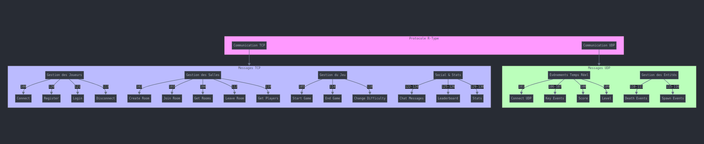

# Network Protocol Documentation  
**Category**: Standards Track  
**Date**: 07/12/2024  

## Protocol for R-Types

### Status of this Document
This document specifies the protocol used for communication between the client and server in a multiplayer game environment. The protocol includes both TCP and UDP messages for actions such as player connections, room management, game events, and player or enemy interactions. Distribution of this memo is unlimited.

---

## Table of Contents

1. [Introduction](#1-introduction)  
2. [Protocol Overview](#2-protocol-overview)  
3. [TCP Communication](#3-tcp-communication)  
4. [UDP Communication](#4-udp-communication)  
5. [Message Definitions](#5-message-definitions)
6. [Bullet Configuration](#6-bullet-configuration)
7. [Entity Configuration](#7-entity-configuration)
8. [Level Configuration](#8-level-configuration)  
9. [Conclusion](#9-conclusion)

---

## 1. Introduction

This document describes the communication protocol used for a multiplayer game. The protocol supports both TCP and UDP for reliable and low-latency operations respectively. Each action is associated with specific message codes exchanged between the client and the server.

---

## 2. Protocol Overview

### Transport Layer Protocols
- **TCP**: Used for reliable operations such as player connections, room creation, and game start.
- **UDP**: Used for real-time events such as key presses, scores, and level updates.

### Message Structure
- Each message is represented by a unique code followed by additional parameters if applicable.

---

## 3. TCP Communication

The following actions are performed over TCP:

| **Action**             | **Code (Server)**                   | **Code (Client)**        |
|------------------------|-------------------------------------|--------------------------|
| Connect                | `100 - PLAYER_ID`                   | `100 - PLAYER_ID`        |
| Create room            | `102 - NAME - PASSWORD - MAX_PLAYER`| `102 - OK/KO`            |
| Join room              | `103 - ID_ROOM - PASSWORD`          | `103 - OK/KO`            |
| Get rooms              | `104`                               | `104 - ROOMS`            |
| Start game             | `105`                               | `105 - OK/KO`            |
| Leave room             | `112`                               | `112 - OK/KO - LIST_OF_ID`|
| Disconnect             | `113`                               | `113 - PLAYER_ID`        |
| End game               | `114`                               | `114`                    |
| Change difficulty      | `118 - EASY/MEDIUM/HARD`            | `118 - OK/KO`            |
| Get players in room    | `119`                               | `119 - LIST_OF_ID`       |

### Additional TCP Messages

The following additional TCP messages are supported:

| **Action**             | **Code (Server)**                   | **Code (Client)**        |
|------------------------|-------------------------------------|--------------------------|
| Register player        | `120 - USERNAME - PASSWORD`         | `120 - OK/KO`            |
| Login player           | `121 - USERNAME - PASSWORD`         | `121 - OK/KO`            |
| Private message        | `122 - PLAYER_ID - MESSAGE`         | `122 - OK/KO`            |
| Room message           | `123 - MESSAGE`                     | `123 - OK/KO`            |
| Main menu message      | `124 - MESSAGE`                     | `124 - OK/KO`            |
| Get leaderboard        | `125`                               | `125 - LEADERBOARD`      |
| Set score              | `126 - SCORE`                       | `126 - OK/KO`            |
| Matchmaking            | `127`                               | `127 - OK/KO`            |
| Get all stats          | `129`                               | `129 - STATS`            |
| Get player stats       | `130 - PLAYER_ID`                   | `130 - STATS`            |

### Protocol Implementation Details

The Protocol class provides several key utility methods:

- `parseMessage`: Splits incoming messages into command and parameter components
- `parseSentence`: Handles parsing of complex message content like chat messages
- `prepareMessage`: Formats outgoing messages according to protocol standards
- `banWordCheck`: Content moderation system for chat messages
- `getEntitiesInfoAsJson`: Converts game entity data into JSON format for transmission

The protocol handles automated player management with:

- Auto-incrementing player IDs for unique identification
- Automatic socket cleanup on disconnection
- Room state synchronization
- Player authentication and session management

---

## 4. UDP Communication

The following actions are performed over UDP:

| **Action**             | **Code (Server)**               | **Code (Client)**       |
|------------------------|---------------------------------|-------------------------|
| Connect                | `101 - PLAYER_ID`               | `101 - OK`              |
| Event HOLD             | `106 - ENUM_KEY`                | `106 - OK - KEY_PRESSED` |
| Event PUSH             | `107 - ENUM_KEY`                | `107 - OK - KEY_PRESSED` |
| Score                  | `108 - SCORE (+/-)`             | `108 - OK - SCORE`       |
| Level                  | `109 - LEVEL`                   | `109 - LEVEL`            |
| Player death           | `110`                           | `110 - PLAYER_ID`        |
| Enemy death            | `111`                           | `111 - ID`               |
| Enemy spawn            | `115 - ID - POS - TYPE`         | `115 - ID - POS - TYPE`  |
| Player spawn           | `116 - ID - POS`                | `116 - ID - POS`         |

---

## 5. Message Definitions

Each message contains the following components:
- **Code**: A unique identifier for the action.
- **Parameters**: Additional data required for the action, such as player IDs, positions, or statuses.

### Example Messages

#### Connect (TCP)
- **Server Receives**: `100`
- **Client Receives**: `100 - PLAYER_ID`

#### Create a room (TCP)
- **Server Receives**: `102 - NAME - PASSWORD - MAX_PLAYER`
- **Client Receives**: `102 - OK/KO`

### User Database Structure

The user database stores player information in JSON format with the following fields:

| **Field**             | **Type**               | **Description**       |
|------------------------|---------------------------------|-------------------------|
| id             | string                | Unique identifier for the user |
| password             | string                | User's authentication password |
| tcp_socket                  | string             | TCP socket identifier for connections       |
| udp_socket                  | string                   | UDP socket identifier for connections            |
| username           | string                | Display name of the user         |

Socket fields (`tcp_socket`, `udp_socket`) are populated during active connections and cleared upon disconnection.

### Database Management Functions

The database management system includes the following key functionalities:

| **Function**             | **Description**       |
|------------------------|-------------------------|
| readDatabaseFile             | Reads user data from JSON file into memory |
| writeInDatabase             | Appends messages to specified database file |
| getUsernameFromId                  | Retrives username using player ID       |
| getIdFromUsernameAndPassword                  | Authenticates and returns ID using credentials            |
| getLastId           | Returns the highest user ID in database         |
| setUserId             | Creates new user entry with specified ID |
| setUsernameFromId             | Updates username for specified user ID |
| setPasswordFromId                  | Updates password for specified user ID       |
| setTcpSocketFromId                  | Updates TCP socket information for user            |
| setUdpSocketFromId           | Updates UDP socket information for user         |
| checkIfPlayerAlreadyExist             | Verifies if username/password combination exists |
| checkIfUsernameAlreadyTaken             | Checks if username is already in use |
| getLeaderboard                  | Retrieves leaderboard data from file       |
| setNewScoreInLeaderBoard                  | Updates player score and returns ranking position            |

The database system maintains user records and game statistics using JSON file storage, with support for:
- User authentication and profile management
- Socket connection tracking
- Leaderboard management
- Data persistence across sessions

---

## 6. Bullet Configuration

The game includes different types of bullets with varying characteristics. These configurations are defined for different difficulty levels.

Easy Mode Bullet Types:
* **BASIC**: Standard bullet type
  - Speed: 2
  - Damage: 10
  - Hitbox: 5x5
  - Spawn Timer: 10

* **FAST**: High-velocity, lower damage bullet
  - Speed: 5
  - Damage: 5
  - Hitbox: 5x5
  - Spawn Timer: 5

* **TANK**: Slow but powerful bullet
  - Speed: 1
  - Damage: 20
  - Hitbox: 5x5
  - Spawn Timer: 20

Medium Mode Bullet Types:
* **BASIC**: Standard bullet type
  - Speed: 2
  - Damage: 10
  - Hitbox: 5x5
  - Spawn Timer: 10

* **FAST**: High-velocity, lower damage bullet
  - Speed: 5
  - Damage: 5
  - Hitbox: 5x5
  - Spawn Timer: 5

* **TANK**: Slow but powerful bullet
  - Speed: 1
  - Damage: 20
  - Hitbox: 5x5
  - Spawn Timer: 20

Hard Mode Bullet Types:
* **BASIC**: Standard bullet type
  - Speed: 2
  - Damage: 10
  - Hitbox: 5x5
  - Spawn Timer: 10

* **FAST**: High-speed bullet with lower damage
  - Speed: 5
  - Damage: 5
  - Hitbox: 5x5
  - Spawn Timer: 5

* **TANK**: Slow but powerful bullet
  - Speed: 1
  - Damage: 20
  - Hitbox: 5x5
  - Spawn Timer: 20

Bullet Properties
Each bullet type's properties affect gameplay mechanics and strategy:
- Speed determines bullet velocity in game units
- Damage indicates hit points removed on impact
- Hitbox defines the collision detection area
- Spawn Timer controls the bullet generation frequency

---

## 7. Entity Configuration

The game features different entity types, each with unique characteristics and behaviors. These configurations are defined for various difficulty levels, and the `Entity` class manages these entities. Each entity is characterized by an ID, a group, and a type, with components that define its behavior and attributes. The class supports dynamic management of these components and includes functionality for marking entities for deletion.

#### Entity Class Structure:
- **ID**: The unique identifier for each entity.
- **Group**: Classification of the entity (e.g., enemy, player, powerup).
- **Type**: Specific type of entity (e.g., BASIC, FAST, TANK).
- **Components**: Properties such as health, position, state, etc., which can be dynamically added or accessed.
- **Deletion Flag**: Entities can be marked for deletion, updating their state to "DELETE" when necessary.

Entities are grouped into different types based on their difficulty mode, and each type has the following properties:

### Easy Mode Entity Types:

* **BASIC**
  - Health: 100
  - Speed: 1
  - Reward: 10
  - Movement: Linear pattern, moving left
  - Hitbox: 20x20
  - Bullet Type: BASIC
  - Time Remaining: 0

* **FAST**
  - Health: 50
  - Speed: 2
  - Reward: 20
  - Movement: Sinusoidal pattern, moving left
  - Hitbox: 10x10
  - Bullet Type: FAST
  - Time Remaining: 0

* **TANK**
  - Health: 200
  - Speed: 0.5
  - Reward: 30
  - Movement: Linear pattern, moving up
  - Hitbox: 30x30
  - Bullet Type: TANK
  - Time Remaining: 0

* **PLAYER**
  - Health: 100
  - Speed: 1
  - Reward: 0
  - Movement: No default pattern or direction
  - Hitbox: 20x20
  - Bullet Type: BASIC
  - Time Remaining: 0

* **POWERUP**
  - Health: 0
  - Speed: 0
  - Reward: 0
  - Movement: No default pattern or direction
  - Hitbox: 5x5
  - Bullet Type: None
  - Time Remaining: 10

### Medium Mode Entity Types:

* **BASIC**
  - Health: 100
  - Speed: 1
  - Reward: 10
  - Movement:
    - Pattern: Linear
    - Direction: Left
  - Hitbox: 20x20
  - Bullet Type: BASIC
  - Time Remaining: 0

* **FAST**
  - Health: 50
  - Speed: 2
  - Reward: 20
  - Movement:
    - Pattern: Sinusoidal
    - Direction: Left
  - Hitbox: 10x10
  - Bullet Type: FAST
  - Time Remaining: 0

* **TANK**
  - Health: 200
  - Speed: 0.5
  - Reward: 30
  - Movement:
    - Pattern: Linear
    - Direction: Up
  - Hitbox: 30x30
  - Bullet Type: TANK
  - Time Remaining: 0

* **PLAYER**
  - Health: 100
  - Speed: 1
  - Reward: 0
  - Movement:
    - Pattern: None
    - Direction: None
  - Hitbox: 20x20
  - Bullet Type: BASIC
  - Time Remaining: 0

* **POWERUP**
  - Health: 0
  - Speed: 0
  - Reward: 0
  - Movement:
    - Pattern: None
    - Direction: None
  - Hitbox: 5x5
  - Bullet Type: None
  - Time Remaining: 10

### Hard Mode Entity Types:

* **BASIC**
  - Health: 100
  - Speed: 1
  - Reward: 10
  - Movement:
    - Pattern: Linear
    - Direction: Left
  - Hitbox: 20x20
  - Bullet Type: BASIC
  - Time Remaining: 0

* **FAST**
  - Health: 50
  - Speed: 2
  - Reward: 20
  - Movement:
    - Pattern: Sinusoidal
    - Direction: Left
  - Hitbox: 10x10
  - Bullet Type: FAST
  - Time Remaining: 0

* **TANK**
  - Health: 200
  - Speed: 0.5
  - Reward: 30
  - Movement:
    - Pattern: Linear
    - Direction: Up
  - Hitbox: 30x30
  - Bullet Type: TANK
  - Time Remaining: 0

* **PLAYER**
  - Health: 100
  - Speed: 1
  - Reward: 0
  - Movement: No default pattern or direction
  - Hitbox: 20x20
  - Bullet Type: BASIC
  - Time Remaining: 0

* **POWERUP**
  - Health: 0
  - Speed: 0
  - Reward: 0
  - Movement: No default pattern or direction
  - Hitbox: 5x5
  - Bullet Type: None
  - Time Remaining: 10

Each entity type's properties affect gameplay mechanics:
- Health determines entity durability
- Speed affects movement velocity
- Reward indicates points awarded upon defeat
- Movement patterns define entity behavior
- Hitbox determines collision detection area
- Bullet Type specifies projectile characteristics
- Time Remaining is used for temporary entities (like power-ups)

---

## 8. Level Configuration

The game is divided into levels, each containing a set of entities with specific spawn configurations. These levels define the pacing and difficulty progression in the game.

Easy Mode Levels:

**Level 1**
* Name: level1
* Entities:
  * **BASIC**:
    - Spawn Timer: 1
    - Position: (90, 10)
  * **POWERUP**:
    - Spawn Timer: 10
    - Position: (90, 10)

**Level 2**
* Name: level2
* Entities:
  * **BASIC**:
    - Spawn Timer: 0
    - Position: (0, 0)
  * **FAST**:
    - Spawn Timer: 0
    - Position: (0, 0)
  * **TANK**:
    - Spawn Timer: 0
    - Position: (0, 0)

Medium Mode Levels:

**Level 1**
* Name: level1
* Entities:
  * **BASIC**:
    - Spawn Timer: 1
    - Position: (90, 10)
  * **POWERUP**:
    - Spawn Timer: 10
    - Position: (90, 10)

**Level 2**
* Name: level2
* Entities:
  * **BASIC**:
    - Spawn Timer: 0
    - Position: (0, 0)
  * **FAST**:
    - Spawn Timer: 0
    - Position: (0, 0)
  * **TANK**:
    - Spawn Timer: 0
    - Position: (0, 0)

Hard Mode Levels:

**Level 1**
* Name: level1
* Entities:
  * **BASIC**:
    - Spawn Timer: 1
    - Position: (90, 54)
  * **BASIC**:
    - Spawn Timer: 5
    - Position: (90, 25)
  * **BASIC**:
    - Spawn Timer: 10
    - Position: (90, 75)
  * **BASIC**:
    - Spawn Timer: 10
    - Position: (90, 75)
  * **BASIC**:
    - Spawn Timer: 15
    - Position: (90, 14)
  * **POWERUP**:
    - Spawn Timer: 20
    - Position: (90, 2)

**Level 2**
* Name: level2
* Entities:
  * **BASIC**:
    - Spawn Timer: 0
    - Position: (0, 0)
  * **FAST**:
    - Spawn Timer: 0
    - Position: (0, 0)
  * **TANK**:
    - Spawn Timer: 0
    - Position: (0, 0)

Each level's configuration impacts the gameplay experience by introducing specific challenges and opportunities:
- Spawn Timer controls when entities appear in the level.
- Position determines the initial placement of entities on the game field.

---

## 9. Conclusion

This protocol provides a structured approach for client-server communication in a multiplayer game. It supports a combination of reliable and real-time messaging to ensure a smooth gaming experience. Future extensions of this protocol may include additional actions or improved parameter formats.

---

**[Epitech] Standards Track © 2024**
